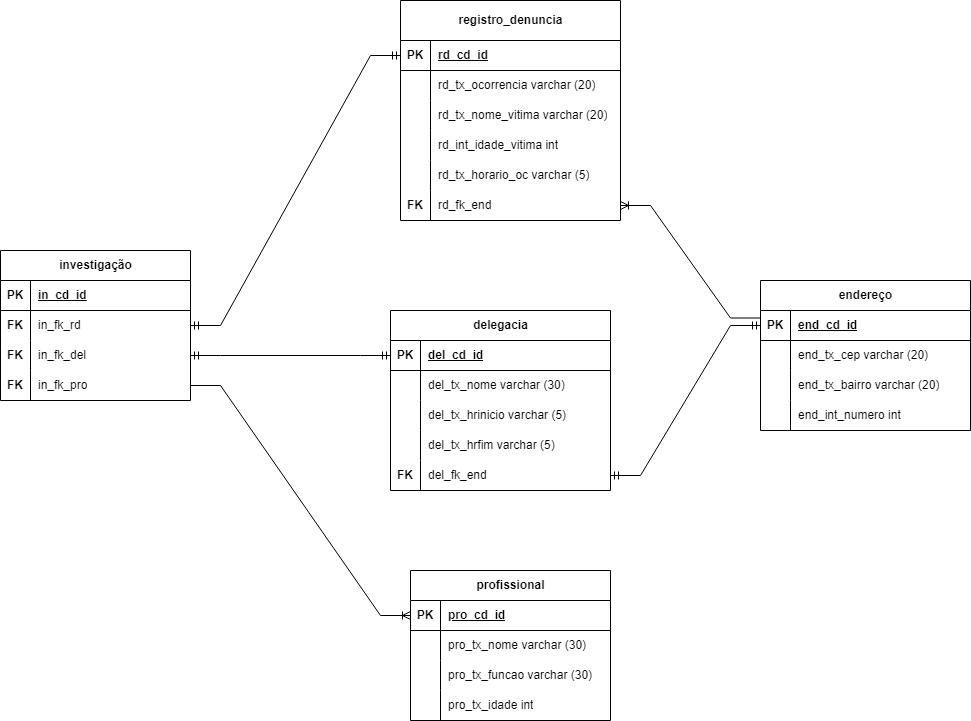

<h1 align="center">
    
Trabalho Individual Final - SERRATEC

</h1>

 
  
 Bem-vindo(a) ao meu repositório individual de Programação Orientada ao Objeto.

## :detective:Índice

<ul>
    <li>Sobre o Projeto</li>
    <li>Tecnologias utilizadas</li>
    <li>Diagrama</li>
    <li>Autores do Projeto</li>
</ul>

## :desktop_computer:Sobre o Projeto

Contexto do Trabalho:
O projeto armazena informações sobre delegacias variadas e seus respectivos endereços. Ele possui as funcionalidades de informar no console e de forma impressa em arquivos .txt: os perfis das delegacias, quais bairros de Petrópolis possuem delegacias e informa cada delegacia com seu respectivo bairro, cep e número.

## :hammer_and_wrench: Tecnologias utilizadas

- [Spring](https://spring.io/tools)
- [Draw.io](https://app.diagrams.net/)
- [GitHub](https://github.com/)

## :chart_with_upwards_trend: Modelo Lógico de Banco de Dados

 

## 👧:Autora

<a href="https://github.com/rafxbc">Rafaela Beber Coelho</a> 

